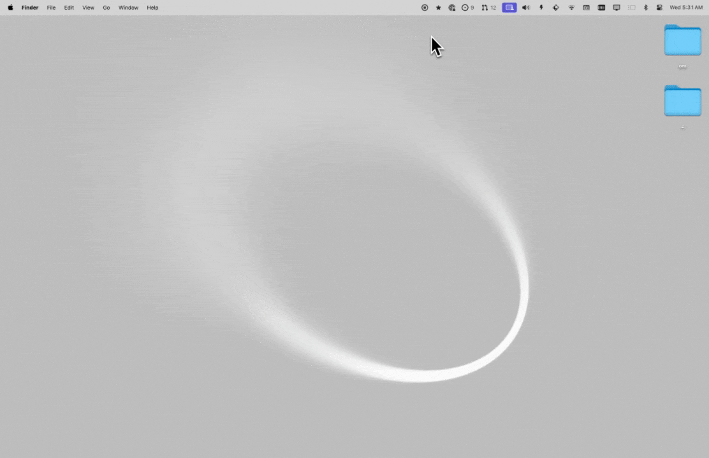

# Tauri macOS Menubar App Example

This is an example project that shows how to create a macOS Menubar app using Tauri.

> Check out the [v2-popover](https://github.com/ahkohd/tauri-macos-menubar-app-example/tree/v2-popover) branch for an example of the menubar app, now featuring a popover view.

This template is based on Tauri + React + Typescript template. It should help get you started developing with Tauri, React and Typescript in Vite.

## Prerequisites

- _[<ins>Node.js<ins>](https://nodejs.org)_
- _[<ins>Tauri CLI<ins>](https://tauri.studio/docs/getting-started/installation)_

## Getting Started

1. Clone this repository:

```
git clone https://github.com/ahkohd/tauri-macos-menubar-app-example.git
```

2. Navigate to the project directory:

```
cd tauri-macos-menubar-app-example
```

3. Run the demo

```
pnpm install
pnpm tauri dev
```

5. Go to your menubar, click the Tauri tray icon.

## Demo

See it in action:



## Recommended IDE Setup

- [VS Code](https://code.visualstudio.com/) + [Tauri](https://marketplace.visualstudio.com/items?itemName=tauri-apps.tauri-vscode) + [rust-analyzer](https://marketplace.visualstudio.com/items?itemName=rust-lang.rust-analyzer)

# Related

The following are related to this project:

- [tauri-nspanel](https://github.com/ahkohd/tauri-nspanel/tree/main/examples/vanilla): Tauri plugin to convert a window to panel.

# License

This project is licensed under the MIT License. See the [LICENSE](./LICENSE.md) file for details.
